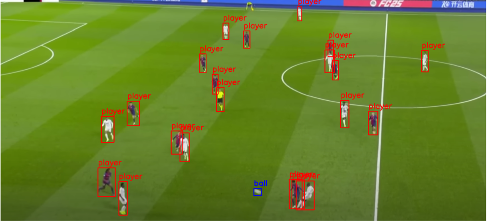
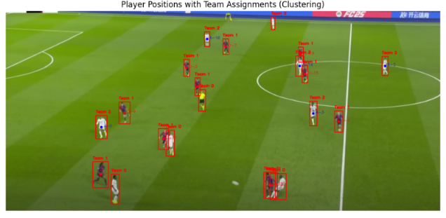
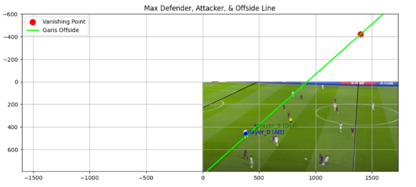

# ⚽ YOLOv8 Football Offside Detection

Proyek ini bertujuan untuk mendeteksi posisi **offside** pemain sepak bola secara otomatis dari sebuah *frame* gambar pertandingan, menggunakan kombinasi *object detection* (YOLOv8), *clustering* warna *jersey*, dan geometri *vanishing point* dari garis lapangan.

## 📋 Deskripsi Proyek

*Pipeline* proyek ini terdiri dari beberapa tahap utama:

1. **Deteksi objek** (bola, kiper, pemain, wasit) menggunakan model YOLOv8 yang dilatih pada dataset khusus sepak bola.
2. **Klasifikasi tim** setiap pemain berdasarkan warna dominan *jersey* menggunakan segmentasi warna (HSV *masking*) dan K-Means Clustering.
3. **Deteksi garis lapangan** menggunakan *Hough Line Transform* untuk menemukan *vanishing point* (titik lenyap perspektif) dari gambar.
4. **Analisis offside** dengan menghitung sudut setiap pemain terhadap *vanishing point*, lalu membandingkan posisi pemain penyerang terjauh dengan pemain bertahan terakhir untuk menentukan status offside.

## 📁 Struktur Repository

```
yolov8-football-offside-detection/
├── assets/
│   ├── clustering.png          # Visualisasi hasil clustering warna jersey
│   ├── offside_line.png        # Visualisasi garis offside & vanishing point
│   └── player_detection.png    # Visualisasi hasil deteksi YOLOv8
├── data/
│   └── dataset.zip             # Dataset training (format YOLO)
├── notebooks/
│   └── pendeteksian-posisi-offside-pemain-berbasis-yolo.ipynb
├── .gitignore
└── README.md
```

## 🗂️ Struktur Dataset

Dataset menggunakan format YOLO dengan konfigurasi berikut:

| Split | Jumlah Gambar |
|---|---|
| **Train** | 298 |
| **Validation** | 49 |
| **Test** | 25 |

**Kelas (4 label):**

```
0 - ball
1 - goalkeeper
2 - player
3 - referee
```

## 🧠 Model & Training

- **Base model:** YOLOv8l (`yolov8l.pt`)
- **Epochs:** 50
- **Image size:** 640
- **Batch size:** 16
- **Optimizer:** SGD (`lr0=0.01`, `momentum=0.937`)
- **Augmentasi:** HSV jitter, flip horizontal, scaling, translation

**Hasil evaluasi akhir (validation set):**

| Metrik | Skor |
|---|---|
| **Precision** | 0.914 |
| **Recall** | 0.803 |
| **mAP50** | 0.849 |
| **mAP50-95** | 0.540 |

## 🎨 Klasifikasi Tim (Jersey Color Clustering)

Setelah deteksi pemain, warna dominan *jersey* diekstraksi dari bagian atas *bounding box* (area badan) dengan langkah:

1. Masking warna hijau rumput dihilangkan menggunakan threshold HSV.
2. Warna dominan diambil dari piksel non-hijau menggunakan K-Means (k=1).
3. Seluruh warna jersey pemain dikelompokkan menjadi beberapa tim menggunakan K-Means Clustering (k=3) — mewakili tim A, tim B, dan wasit/kiper.
4. Validasi kualitas cluster menggunakan Silhouette Score.

## 📐 Deteksi Vanishing Point & Analisis Offside

1. *Hough Line Transform* digunakan untuk mendeteksi garis-garis lapangan (garis lurus) dari citra yang telah melalui proses Gaussian Blur dan Canny Edge Detection.
2. Titik potong (*intersection*) antar garis dihitung, kemudian diambil median-nya sebagai estimasi *vanishing point*.
3. Sudut setiap pemain terhadap *vanishing point* dihitung menggunakan `arctan2`.
4. Pemain penyerang dengan sudut terbesar (paling maju) dibandingkan dengan pemain bertahan terakhir (sudut terbesar di tim bertahan).
5. Jika sudut pemain penyerang > sudut pemain bertahan terakhir → **OFFSIDE** terdeteksi, divisualisasikan dengan garis offside berwarna hijau.

## 🛠️ Teknologi yang Digunakan

- [Ultralytics YOLOv8](https://github.com/ultralytics/ultralytics) — deteksi objek
- OpenCV (`cv2`) — pemrosesan citra, Hough Transform, visualisasi
- scikit-learn (`KMeans`, `silhouette_score`) — clustering warna jersey
- NumPy & Matplotlib — komputasi numerik dan visualisasi

## 🚀 Cara Menjalankan

**1. Clone repository:**

```bash
git clone https://github.com/DwikiFebrian/yolov8-football-offside-detection.git
cd yolov8-football-offside-detection
```

**2. Install dependensi:**

```bash
pip install ultralytics opencv-python scikit-learn numpy matplotlib pyyaml
```

**3. Ekstrak dataset:**

```bash
unzip data/dataset.zip -d data/
```

**4. Siapkan file `data.yaml`:**

```yaml
train: data/train/images
val: data/valid/images
test: data/test/images
nc: 4
names: ['ball', 'goalkeeper', 'player', 'referee']
```

**5. Latih model:**

```python
from ultralytics import YOLO

model = YOLO('yolov8l.pt')
model.train(data='data.yaml', epochs=50, imgsz=640, batch=16)
```

**6. Jalankan inferensi dan analisis offside** pada gambar baru menggunakan model hasil training (`best.pt`). Notebook lengkap tersedia di [`notebooks/pendeteksian-posisi-offside-pemain-berbasis-yolo.ipynb`](notebooks/pendeteksian-posisi-offside-pemain-berbasis-yolo.ipynb).

## 📊 Contoh Output

**1. Deteksi Pemain, Bola, Kiper, dan Wasit (YOLOv8)**



**2. Klasifikasi Tim Berdasarkan Warna Jersey (K-Means Clustering)**



**3. Vanishing Point & Garis Offside**



## ⚠️ Keterbatasan

- Deteksi vanishing point sangat bergantung pada kualitas garis lapangan yang terdeteksi oleh Hough Transform, sehingga rentan terhadap noise pada citra dengan sudut kamera tertentu.
- Klasifikasi tim berbasis warna jersey dapat kurang akurat jika dua tim memiliki warna yang mirip atau pencahayaan tidak merata.
- Model dilatih pada dataset berukuran relatif kecil (372 gambar total), sehingga generalisasi ke pertandingan/kondisi lain masih terbatas.
